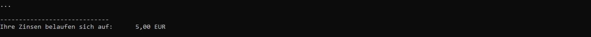

  

        
  

  
 
        <h1>C#-Grundlagen</h1>
        <h3>Arithmetische Operatoren einsetzen</h3>

## :dart: Zielsetzung

Dieser Auftrag hat folgende Ziele:

+ Einfache Programmierprobleme nutzen, um die in den Modulen 1, 2, 3 und 4 behandelten Themen zu Vertiefen
+ Üben ein Problem in kleinere Teilprobleme zu zerlegen
+ Üben Informationen zu Recherchieren, die nicht explizit in der Aufgabenstellung genannt werden
+ Üben Sie das Erstellen, Klonen und Einreichen von Aufträgen über Visual Studio 2022 und GitHub

##  :school_satchel: Skills

+ Zerlegung eines Problems in eine Folge einfacher Aufgaben oder Berechnungen
+ Nutzung des Internets, um Informationen oder Formeln zu finden, die zur Lösung von Programmieraufgaben benötigt werden
+ Verwendung von Zuweisungs-Workflow-Schritten

## :bulb: Benötigtes Wissen
+ Konsolenausgabe formatieren und Daten über die Konsole einlesen
+ Verwendung und Konvertierung von Variablen mit unterschiedlichen Datentypen
+ Verarbeitung von Variablen und Literalen durch Operatoren
+ Anweisungen unter verschiedenen Bedingungen

## :bookmark_tabs: Informationsquelle
Das Informationsmaterial zur Aufgabe finden Sie [hier](https://github.com/GSO-SW/csharp-operatoren-A1-N1-V1-assignment-lerngruppe/blob/fc072b6ed446678f07d8cfdfd9771f7b23f0ff5a/AddFiles/SAS_Operatoren_Info.pdf)
  
---

### Aufgabe 1: Zinsrechner

Schreiben Sie ein Programm zur Berechnung der Zinsen. Der Ablauf des Programms ist wie folgt: 

+ Eingabe: Startkapital, Zinssatz in Prozent
+ Berechnung: Zinsesn = Startkapital*(Zinssatz/100)
+ Ausgabe: Zinsen

> :information_source: **Hinweise**:exclamation:
> + Sie müssen die Ausgabe unter der gestrichelten linie erzeugen um den Test zu bestehen. 
> + Vom Doppelpunkt bis inklusive der letzten Zahl sind es genau zehn Stellen. 
> + Beachten Sie, dass die Ausgabe auf zwei Nachkommastellen gerundet ist.

Beispiel 1 (Gleicher Wert) Ausgabe/Ergebnis:

---
  
### Aufgabe 4: Arbeit einreichen

1. In Visual Studio 2022 das Fenster "Git-Änderungen" aufrufen
2. Eine kurze Beschreibung Ihrer Änderungen in die Textbox eingeben und "commit für alle" klicken
3. Mit dem Pfeil nach oben die Arbeit auf GitHub pushen.
4. Das Repository im Brower aufrufen und aktualisieren um die Änderungen zu bestätigen.
5. Im Pull-Request die Nachricht "Bereit zum Bewerten" hinterlassen, damit Ihre Lehrkraft weiss das Sie fertig sind.

---
  
# :100: Erfolgskriterien
  
+ Eingesetzten Quellcode kommentieren
+ Quellcode schreiben der lesbar ist und mit Hilfe einer logischen Folge das Problem löst
+ Programmausgabe die korrekt, lesbar und richtig formatiert ist 
